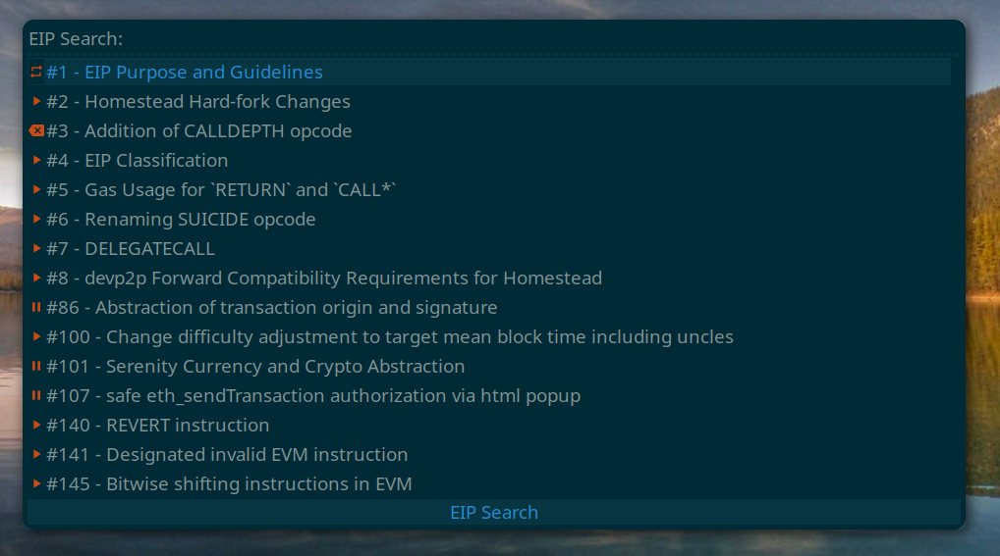

# EIP Search for Rofi

A Rofi compatible implementation of banteg's [raycast-eips](https://github.com/banteg/raycast-eips) to quickly look up Ethereum Improvement Proposals.

## Requirements
* rofi
* git
* yq
* [EIPs Repository](https://github.com/ethereum/EIPs) (will be downloaded automatically if needed)

## Setup
1. Clone the repo or save `eips.rofi.sh`
2. (Optional) Change `EIPS_REPO` to the directory where the EIPs repository is (or will be) saved locally
3. Run `./eips.rofi.sh update`
4. (Optional) Automate updating the EIP index with cron or a similar tool
5. Run with `rofi -modi eips:SCRIPT_LOCATION/eips.rofi.sh -show eips`

## Action
By default selecting an EIP will open it in the browser, but any action can be executed, check the code for an example opening the markdown file locally with [Glow](https://github.com/charmbracelet/glow)

## Icons
The icons used to show an EIP's status are sourced from the theme icons
